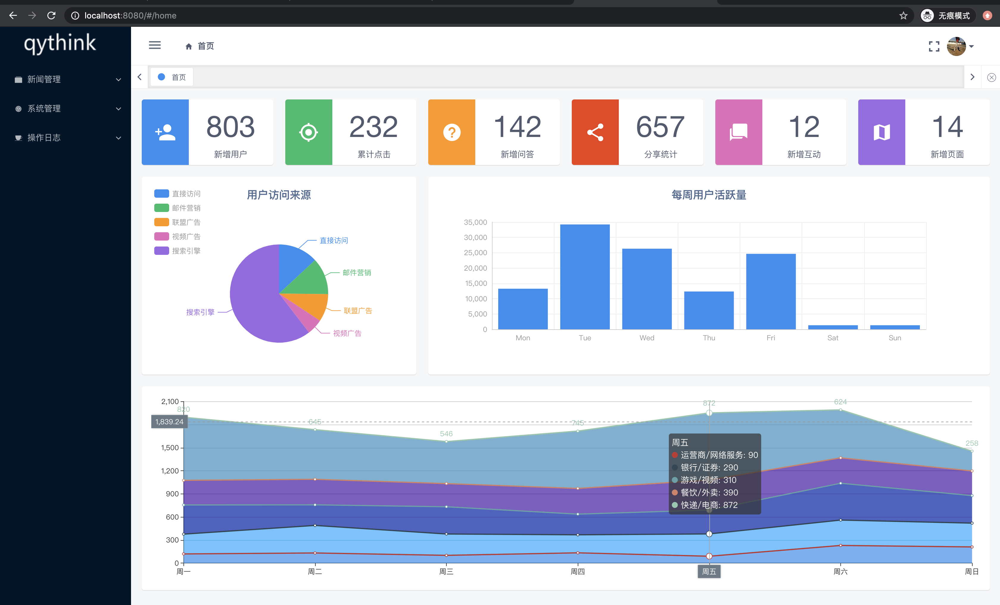
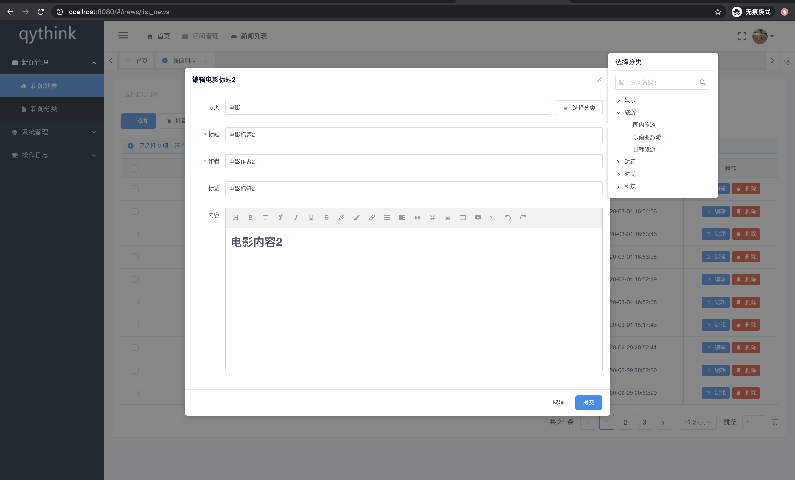
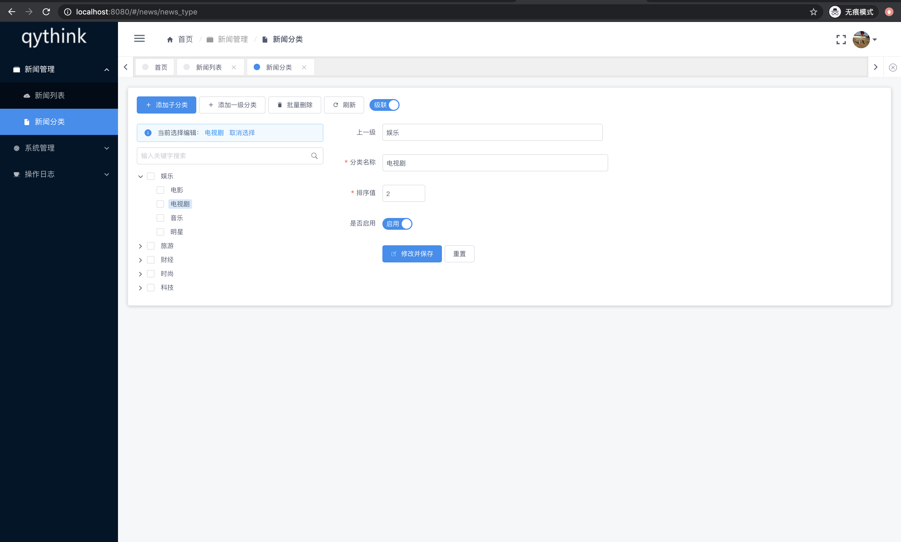
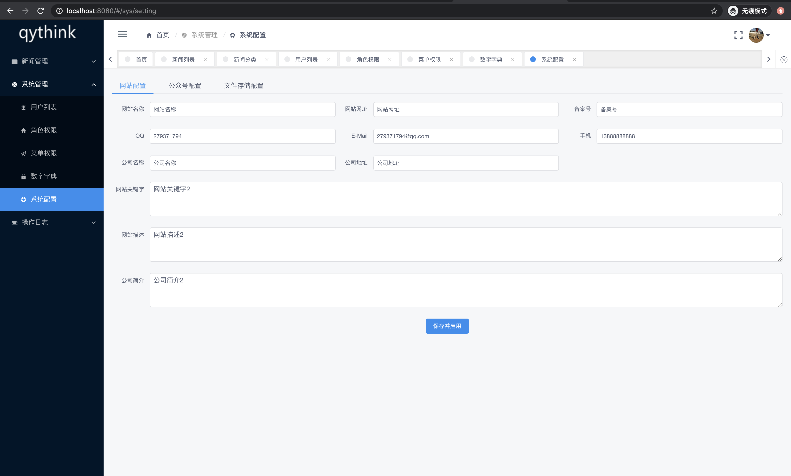

<h1>
基于iView-Admin，属于开箱即用
</h1>

## 简介

iView-admin是iView生态中的成员之一，是一套采用前后端分离开发模式，基于Vue的后台管理系统前端解决方案。iView-admin2.0脱离1.x版本进行重构，换用Webpack4.0 + Vue-cli3.0作为基本开发环境。内置了开发后台管理系统常用的逻辑功能，和开箱即用的业务组件，旨在让开发者能够以最小的成本开发后台管理系统，降低开发量。
- [iview-admin开发文档](https://lison16.github.io/iview-admin-doc/)
- [在线预览](https://admin.iviewui.com/)
- [Base template recommends using](https://github.com/iview/iview-admin/tree/template)


## 配置并运行

* 1、修改`config.php`接口请求地址
```
baseUrl: {
  dev: 'http://qythink.com:7888/',   // 本地dev环境
  pro: 'http://qythink.net/'
},
```
* 2、修改本地代理跨域请求接口地址
```
devServer: {
    proxy: {
      '/': {
        target: process.env.NODE_ENV === 'development' ? 'http://qythink.com:7888/' : '/',
        changeOrigin: true, // 是否允许跨越
        ws: false, // 值为false防止控制台报错★★★★★★★★
        pathRewrite: {
          // ▼或者后台接口统一加一个前缀如api，然后这里不写 '^/' 写 '^/api'。
          '^/': ''
        }
      }
    }
  }
```

## 网站截图





